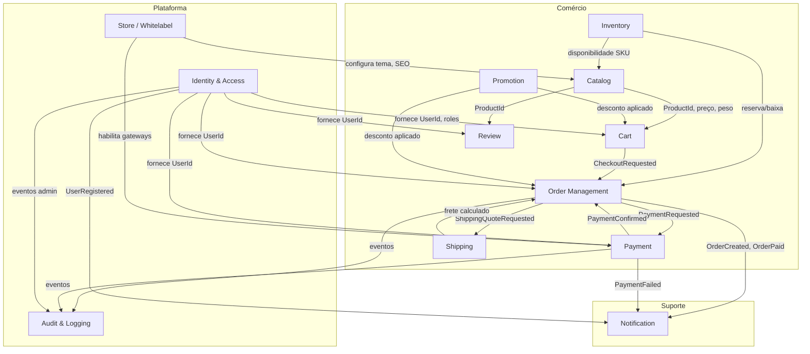

# Context Map — E-commerce Whitelabel

Mapa de contextos delimitados e relacionamentos. Baseado em `docs/discovery.md` e `docs/glossary.md`.

---

## Diagrama



---

## Contextos

### 1. Identity & Access
**Responsabilidade:** autenticação, autorização, perfil, endereços, MFA, OAuth2.

| Item | Detalhe |
|------|---------|
| Agregados | `User`, `Role` |
| Entidades | users, roles, permissions, addresses |
| Expõe | UserId, roles, permissions |
| Consome | — |
| Integração | JWT; eventos `UserRegistered`, `PasswordChanged` |

**Pasta:** `backend/app/domain/users/`

---

### 2. Store / Whitelabel
**Responsabilidade:** configuração da loja, tema, banners, SEO, settings globais.

| Item | Detalhe |
|------|---------|
| Agregados | `StoreSettings`, `Banner` |
| Entidades | store_settings, themes, banners, seo_metadata |
| Expõe | Configurações para Catalog, Payment |
| Consome | — |

**Pasta:** `backend/app/domain/store/`

---

### 3. Catalog
**Responsabilidade:** produtos, categorias, marcas, tags, mídia, SEO de produto.

| Item | Detalhe |
|------|---------|
| Agregados | `Product`, `Category`, `Brand` |
| Entidades | products, product_images, product_variations, categories, brands, tags |
| Expõe | ProductId, SKU, preço, peso, dimensões |
| Consome | Inventory (disponibilidade read-only via query) |

**Pasta:** `backend/app/domain/products/`, `categories/`

---

### 4. Inventory
**Responsabilidade:** estoque, reservas, movimentações, alertas de estoque baixo.

| Item | Detalhe |
|------|---------|
| Agregados | `InventoryItem`, `StockMovement` |
| Entidades | inventory, stock_movements |
| Expõe | Quantidade disponível, reserva |
| Consome | ProductId / SKU do Catalog |

**Pasta:** `backend/app/domain/inventory/`

---

### 5. Cart
**Responsabilidade:** carrinho de compras anônimo e autenticado.

| Item | Detalhe |
|------|---------|
| Agregados | `Cart` |
| Entidades | carts, cart_items |
| Expõe | Itens, totais parciais |
| Consome | Catalog (preço, produto), Promotion (cupom preview) |

**Pasta:** `backend/app/domain/cart/` *(implícito em orders ou módulo dedicado)*

---

### 6. Order Management
**Responsabilidade:** pedidos, itens, histórico de status, nota fiscal (interface).

| Item | Detalhe |
|------|---------|
| Agregados | `Order` |
| Entidades | orders, order_items, order_status_history |
| Expõe | OrderId, status, totais |
| Consome | Cart, Payment, Shipping, Promotion, Inventory |

**Pasta:** `backend/app/domain/orders/`

---

### 7. Payment
**Responsabilidade:** processamento de pagamento, métodos, webhooks de gateway.

| Item | Detalhe |
|------|---------|
| Agregados | `Payment` |
| Entidades | payments, payment_methods |
| Expõe | PaymentId, status |
| Consome | OrderId, Store (gateways habilitados) |
| Adapters | MercadoPago, Stripe, PagSeguro, Asaas |

**Pasta:** `backend/app/domain/payments/`

---

### 8. Shipping
**Responsabilidade:** cálculo de frete, integração Correios/ViaCEP.

| Item | Detalhe |
|------|---------|
| Agregados | `ShippingQuote` |
| Entidades | shipping_methods, shipping_quotes |
| Expõe | Valor e prazo de entrega |
| Consome | Address (CEP), Product (peso/dimensões) |
| Adapters | ViaCEP, Correios |

**Pasta:** `backend/app/domain/shipping/`

---

### 9. Promotion
**Responsabilidade:** cupons, cashback, regras promocionais.

| Item | Detalhe |
|------|---------|
| Agregados | `Coupon` |
| Entidades | coupons, coupon_usages, cashback_ledger |
| Expõe | Desconto calculado |
| Consome | Cart/Order totals, UserId |

**Pasta:** `backend/app/domain/coupon/`

---

### 10. Review
**Responsabilidade:** avaliações e notas de produtos.

| Item | Detalhe |
|------|---------|
| Agregados | `Review` |
| Entidades | reviews |
| Expõe | Média de notas por produto |
| Consome | ProductId, UserId (compra verificada) |

**Pasta:** `backend/app/domain/review/`

---

### 11. Notification
**Responsabilidade:** envio de e-mails e notificações in-app.

| Item | Detalhe |
|------|---------|
| Agregados | `Notification` |
| Entidades | notifications |
| Consome | Eventos de Order, Payment, Identity |
| Adapters | SMTP, Celery workers |

**Pasta:** `backend/app/domain/notification/`

---

### 12. Audit & Logging
**Responsabilidade:** logs de aplicação e trilha de auditoria admin.

| Item | Detalhe |
|------|---------|
| Entidades | logs, audit_trail |
| Consome | Eventos cross-cutting |

**Pasta:** `backend/app/domain/audit/`

---

## Tipos de relacionamento

| De → Para | Tipo | Mecanismo |
|-----------|------|-----------|
| Cart → Order | Customer-Supplier | Application service orquestra checkout |
| Order → Payment | Customer-Supplier | Porta `PaymentGateway` |
| Order → Shipping | Customer-Supplier | Porta `ShippingCalculator` |
| Catalog ↔ Inventory | Partnership | SKU compartilhado; contratos claros |
| * → Notification | Published Language | Domain events via RabbitMQ |
| * → Audit | Conformist | Eventos append-only |
| Store → Catalog/Payment | Open Host Service | Config API interna |

---

## Shared Kernel (mínimo)

Tipos compartilhados **sem lógica de negócio**:

- `Money` (valor + moeda)
- `Email`, `Phone`
- `Address`, `CEP`
- `EntityId` / UUID wrappers
- `DomainEvent` base

**Pasta:** `backend/app/domain/shared/`

---

## Anti-patterns evitados

- ❌ Contexto "Common" ou "Misc"
- ❌ Produto importando SQLAlchemy
- ❌ Lógica de pagamento no controller
- ❌ Entidades anêmicas sem invariantes

---

## Módulos top-level (backend)

```
backend/app/domain/
├── shared/          # Shared Kernel (VOs)
├── users/           # Identity & Access
├── store/           # Whitelabel
├── products/        # Catalog (produtos)
├── categories/      # Catalog (categorias)
├── inventory/       # Inventory
├── orders/          # Order + Cart
├── payments/        # Payment
├── shipping/        # Shipping
├── coupon/          # Promotion
├── review/          # Review
├── notification/    # Notification
└── audit/           # Audit
```

---

## Frontend (espelhamento por feature)

```
frontend/src/app/
├── core/            # Auth, interceptors, guards
├── shared/          # Componentes, pipes, VOs de UI
├── layout/          # Shell, header, footer whitelabel
├── pages/           # Shopper: login, products, cart, checkout…
└── admin/           # Painel administrativo
```

---

## Contratos de integração (eventos)

| Evento | Publicador | Consumidores |
|--------|------------|--------------|
| `UserRegistered` | Identity | Notification |
| `OrderCreated` | Order | Notification, Inventory (reserva), Audit |
| `OrderPaid` | Payment | Order, Notification, Audit |
| `PaymentFailed` | Payment | Order, Notification |
| `StockLow` | Inventory | Notification (admin) |
| `ProductReviewSubmitted` | Review | Catalog (atualiza média via query) |

---

## Próximo passo

→ Spec 03: modelagem de domínio (entidades, VOs, agregados, eventos) por contexto, começando por **Identity** e **Catalog** (MVP).
