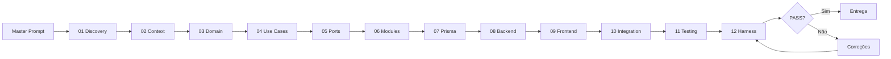

# Workflow — Pipeline de Desenvolvimento

| Camada | Função | Local |
|--------|--------|-------|
| Rules | Guia contínuo | `.cursor/rules/` |
| Specs | Etapas sequenciais | `specs/` |
| Prompt | Orquestração | `prompts/master-prompt.md` |
| Harness | Validação | `harness/scripts/` |
